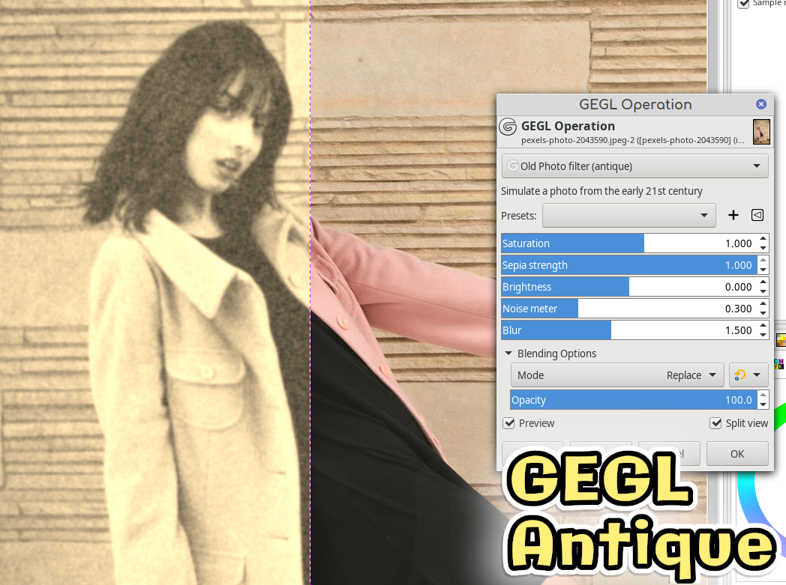

# GEGL---Old-Photo-Effect---Make-your-photos-have-early-20th-century-aesthetics
A new GEGL Filter for Gimp to make antique effects. On Windows and Mac you have to compile. On Linux just put stroke.so in /gegl-0.4/plugins 

