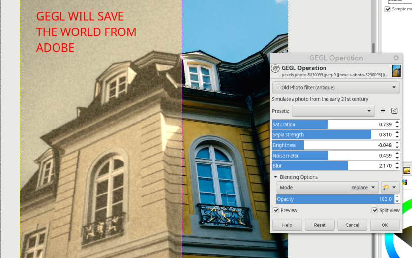

# GEGL---Old-Photo-Effect---Make-your-photos-have-early-20th-century-aesthetics
A new GEGL Filter for Gimp to make antique effects. On Windows and Mac you have to compile. On Linux just put stroke.so in /gegl-0.4/plugins 

## OS specific location to put GEGL Filter binaries 

Windows
 C:\\Users\<YOUR NAME>\AppData\Local\gegl-0.4\plug-ins
 
 Linux 
 /home/(USERNAME)/.local/share/gegl-0.4/plug-ins
 
 Linux (Flatpak)
 /home/(USERNAME)/.var/app/org.gimp.GIMP/data/gegl-0.4/plug-ins

